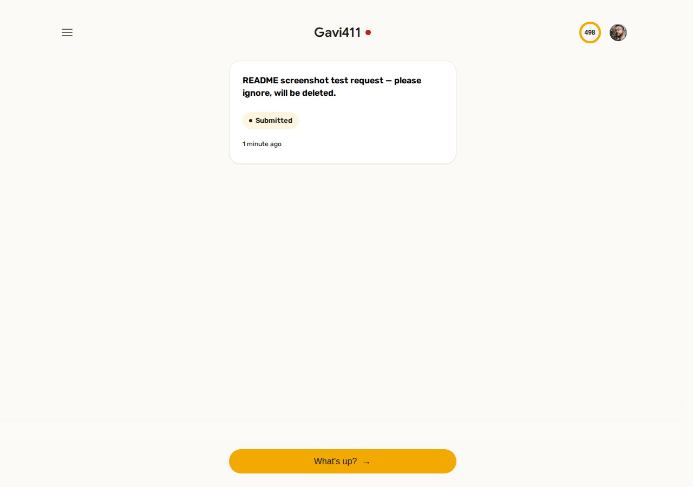
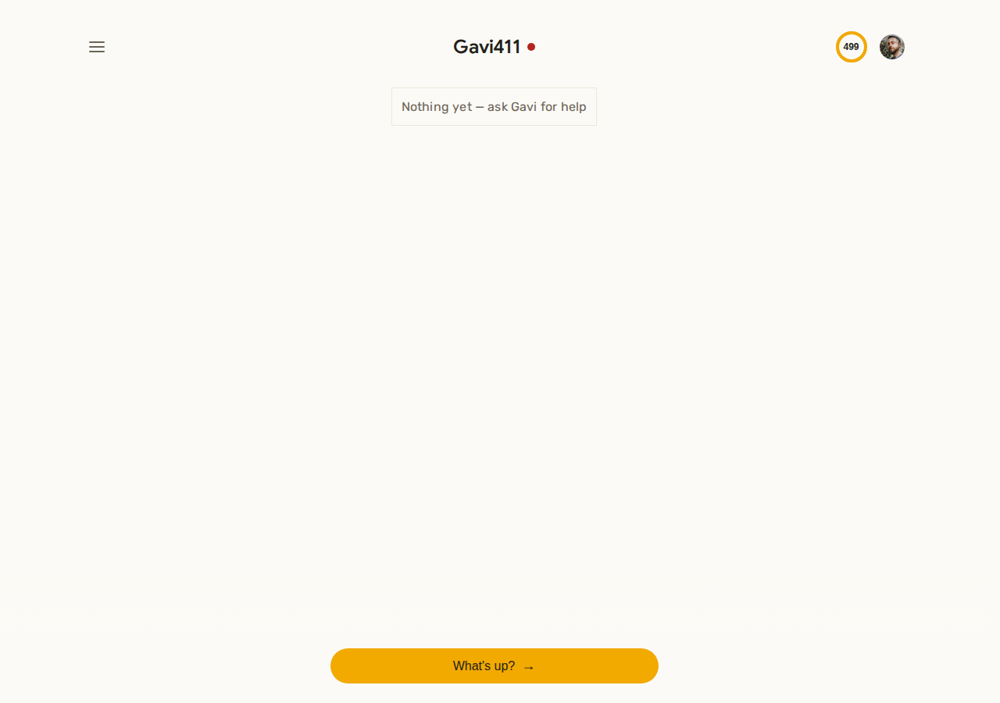
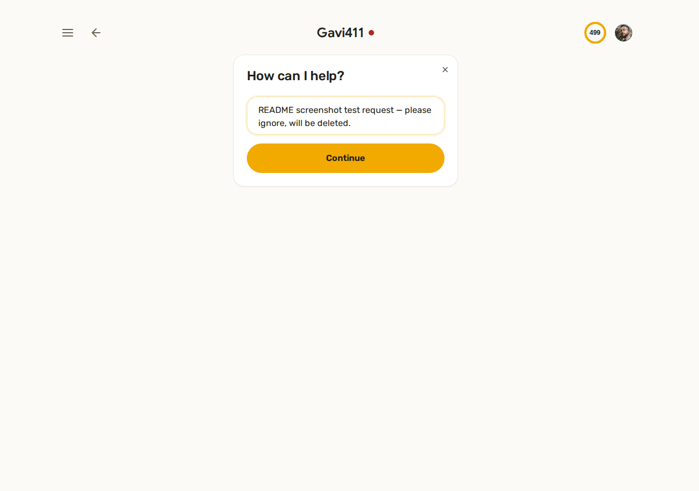
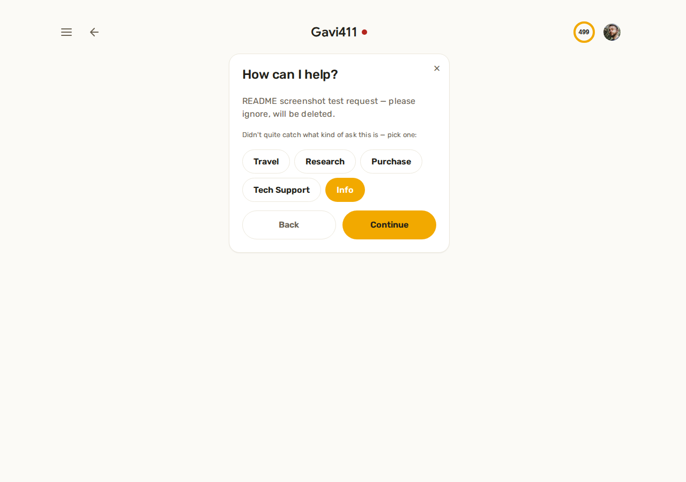
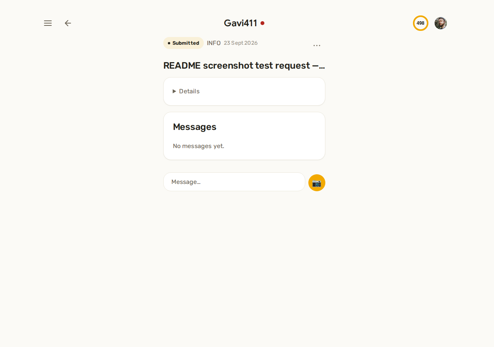

# Gavi411

Digitizes an informal concierge service — friends and family ask for travel
rescue, product research, middleman purchases, tech support, or general
info requests; an admin picks them up and handles them over a shared thread.

[](https://github.com/GaviLazan/Gavi411/actions/workflows/ci.yml)
[](https://gavi411-ten.vercel.app/)

**Live app:** https://gavi411-ten.vercel.app/ (client on Vercel, API on
Render's free tier — the first request after idle can take a few seconds
to wake it up)



## Table of Contents

- [Features](#features)
- [Tech Stack](#tech-stack)
- [Getting Started](#getting-started)
- [Environment Variables](#environment-variables)
- [Available Scripts](#available-scripts)
- [Project Structure](#project-structure)
- [Database](#database)
- [Testing and CI](#testing-and-ci)
- [Walkthrough](#walkthrough)
- [End-to-End Encryption (Paused)](#end-to-end-encryption-paused)
- [Project Documentation](#project-documentation)

## Features

- **Invite-gated signup** — no public registration; a friend can only create
  an account through a one-time invite link generated by the admin.
- **Guided intake** — a short conversational flow (what's up → request type
  → urgency/details → review) that classifies a free-text ask into
  Travel / Research / Purchase / Tech Support / Info, asking a clarifying
  question when it can't tell.
- **Threaded requests** — every request is its own conversation between the
  friend and the admin, with status (Submitted → In Progress → Resolved,
  plus Cancelled/Self-solved paths) shown as a colored chip throughout.
- **Admin cockpit** — a single view listing every open request across every
  friend, with the same thread UI as the friend side.
- **Monthly credits** — each request costs one of the friend's monthly
  "favors," shown as a ring in the app bar; the admin can grant a one-time
  overdraft exception per cycle.
- **Notifications** — Web Push for everyone (new message, status change),
  Telegram as a secondary admin-only channel; a click deep-links straight
  into the relevant request.
- **Multi-device support** — a friend or admin can sign in from a second
  device; the admin approves it once to share existing conversation keys.

## Tech Stack

| Layer | Choice |
| --- | --- |
| Client | React 19 (Vite), plain JavaScript — no TypeScript |
| Server | Node.js + Express, ES modules |
| Database | PostgreSQL via [Neon](https://neon.tech), [Prisma](https://www.prisma.io) ORM |
| Auth | [Clerk](https://clerk.com) (OAuth, invite-gated) |
| Images | Cloudinary |
| Notifications | Web Push (`web-push`) + Telegram Bot API |
| Testing | Vitest |
| Linting | oxlint |
| Deploy | Vercel (client) + Render free tier (server) |

## Getting Started

### Prerequisites

- Node.js (see `package.json` engines, or just use a recent LTS)
- A Neon (or any Postgres) database
- A Clerk application

### Installation

```bash
git clone git@github.com:GaviLazan/Gavi411.git
cd Gavi411
npm install
cd client && npm install && cd ..
npx prisma generate
```

Copy `.env.example` → `.env` (root) and `client/.env.example` →
`client/.env.local`, then fill in real values — see
[Environment Variables](#environment-variables) below for what each one is
for.

Apply the schema:

```bash
npx prisma migrate deploy
```

### Run locally

```bash
npm run dev                  # server, with reload (root)
cd client && npm run dev     # client dev server (Vite)
```

Open the printed local URL (typically `http://localhost:5173`).

## Environment Variables

Names only — no real values belong in version control. `.env.example`
(root) and `client/.env.example` are the source of truth for the exact
files to copy.

**Server (`.env`)**

| Variable | Purpose |
| --- | --- |
| `DATABASE_URL` | Postgres connection string (Neon) |
| `CLERK_SECRET_KEY` / `CLERK_PUBLISHABLE_KEY` | Clerk auth |
| `PORT` | Express server port |
| `CLERK_TEST_EMAIL` / `CLERK_TEST_PASSWORD` / `CLERK_TEST_OTP` | Scripted Playwright sign-in checks only, not required to run the app |
| `CLOUDINARY_URL` | Image uploads |
| `VAPID_PUBLIC_KEY` / `VAPID_PRIVATE_KEY` / `VAPID_SUBJECT` | Web Push |
| `TELEGRAM_BOT_TOKEN` / `TELEGRAM_CHAT_ID` | Admin's secondary Telegram notification channel |
| `FRONTEND_URL` | Builds permalinks embedded in Telegram notifications |

**Client (`.env.local`)**

| Variable | Purpose |
| --- | --- |
| `VITE_CLERK_PUBLISHABLE_KEY` | Same Clerk app as the server, publishable key only |
| `VITE_VAPID_PUBLIC_KEY` | Same VAPID public key as the server |

## Available Scripts

**Root (server)**

| Command | Description |
| --- | --- |
| `npm run dev` | Start the server with auto-reload |
| `npm start` | Start the server (production mode) |
| `npm test` | Run the Vitest suite once |

**`client/`**

| Command | Description |
| --- | --- |
| `npm run dev` | Start the Vite dev server |
| `npm run build` | Production build into `client/dist/` |
| `npm run preview` | Serve the production build locally |
| `npm run lint` | Lint with oxlint |

## Project Structure

```text
server/
├── server.js              # Express app entry point
├── routes/                 # One router per resource (requests, invites, notifications, ...)
├── middleware/              # Auth (Clerk), admin gating
└── lib/                     # Prisma client, invite/credit/matching logic

client/src/
├── main.jsx                # React entry point
├── App.jsx                 # App shell, routing/view state, useSession()
├── pages/                  # Screen-level components (Home, NewRequest, RequestDetail, ...)
├── components/              # Shared UI (Button, Card, StatusChip, CreditRing, ...)
└── lib/                     # Client-side helpers (CSV export, crypto, device linking)

prisma/
├── schema.prisma            # Data model (see Database below)
├── migrations/               # Versioned schema history
└── seed.js                   # Dev-data seeding script
```

Folders are `server/` and `client/`, not `backend`/`frontend`.

## Database

Postgres (hosted on Neon), managed through Prisma migrations
(`prisma/schema.prisma`, `prisma/migrations/`). The core models:

| Model | Purpose |
| --- | --- |
| `User` | Friend or admin account (`role`), credit balance, Clerk identity |
| `Request` | One concierge ask — status, urgency, type, free-text description |
| `Message` | One message in a request's thread |
| `CreditTransaction` | Ledger of credit grants/deductions per user |
| `Notification` | Delivery log for Web Push/Telegram sends |
| `PendingInvite` | One-time invite token; its passphrase exists only in the creation response, never persisted |
| `Device` / `ConversationDeviceKey` | Multi-device key distribution for the (currently paused) E2E messaging feature |
| `PushSubscription` | One row per browser/device that's granted Web Push permission |

Run `npx prisma studio` for a local GUI browser of the schema and data, or
`npx prisma migrate status` to check pending migrations.

## Testing and CI

```bash
npm test              # server + shared unit/integration tests (Vitest)
cd client && npm run lint   # oxlint
cd client && npm run build  # production build must succeed
```

GitHub Actions (`.github/workflows/ci.yml`) runs on every pull request and
every push to `main`: install, then the same test/build steps above. A
branch-protection ruleset on `main` requires this check to pass and an
approving review before merge — direct pushes to `main` are rejected
server-side, backed by a local `pre-push` hook as a first line of defense.

As of the last recorded run: **555/555 tests passing** across 38 test
files, clean build, clean lint.

Every change lands as its own branch and pull request; a sibling review
(reading the real diff, not just trusting a green build) happens before
any merge is asked for.

## Walkthrough

A friend signs up through an invite link, then opens with an empty home
screen and a "What's up?" composer:



Typing a request kicks off a short guided intake. If the free text doesn't
clearly match a known category, the app asks a quick disambiguating
question instead of guessing:




Once submitted, the request becomes a card on the friend's home screen —
tapping it opens the thread, where the friend and admin exchange messages
until it's resolved:




The admin has the same thread view across every open request in one
cockpit, plus the ability to change status, grant a credit overdraft, and
manage invites and linked devices.

## End-to-End Encryption (Paused)

Messaging was designed and partially built for real end-to-end encryption
— each account gets an ECDH keypair, conversation keys are wrapped
per-device (`Device` / `ConversationDeviceKey` above), and an escrow
passphrase was meant to let a lost device recover its key. That work is
**paused as an optional stretch goal** for this project's timeline: message
content is currently stored as **plaintext** in the database. The
`Device`/`ConversationDeviceKey` scaffolding and the escrow passphrase flow
exist in the code but aren't wired into the actual message send/receive
path. See `gavi411-e2e-encryption-plan.md` for the full design and what's
left to finish it.

## Project Documentation

This README covers "how do I run it." Process, design decisions, and
project history live in separate docs at the repo root:

| File | What it's for |
| --- | --- |
| `CLAUDE.md` | Working process rules for anyone (human or agent) picking up a ticket |
| `gavi411-prd.md` | Full product spec |
| `gavi411-brain.md` | Numbered decision log — the "why" behind non-obvious calls |
| `gavi411-finish-line-plan.md` | The remaining-work plan this project was executed against |
| `gavi411-e2e-encryption-plan.md` | Full E2E encryption design (see above) |
| `HANDOFF.md` | Most recent session's state (perishable, overwritten each session) |
