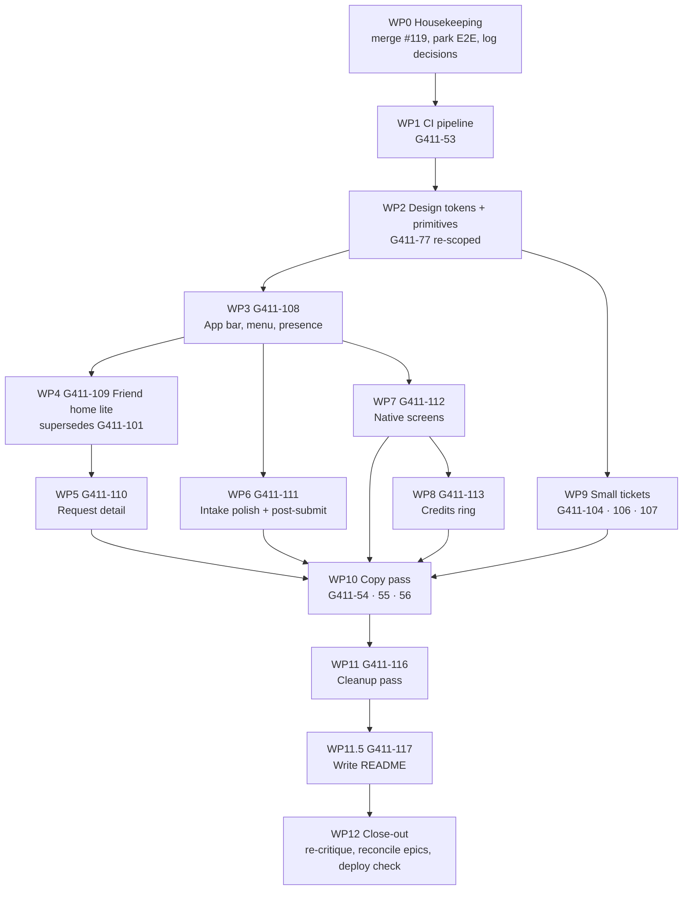

# Gavi411 — Finish-Line Plan

2026-09-18 · Gavi Lazan (definition pass by Claude Fable, orchestrated in-session)

The definition layer for the last stretch: every remaining piece of work as a scoped package a Sonnet session can pick up, dispatch to Haiku, review, and close — in the order that wastes the least. Built from the 2026-09-17 audit (`gavi411-full-project-audit.md`) and design critique plus Gavi's decisions on 2026-09-18. Nothing here has been executed. The live copy of this doc (comments, edits) is the Claude Doc "Gavi411 — Finish-Line Plan"; this file is the repo mirror for executing sessions.

## How to use this plan

This is the **definition layer**. It settles the calls that would otherwise stop a coding session (scope, files, shapes, acceptance), so the executing session can spend its turns on building and reviewing, not re-deriving. ../../CLAUDE.md still governs process; this doc governs *what* and *in which order*.

**Roles.** Sonnet runs each work package end to end: confirms scope with Gavi at STOP 1, dispatches Haiku with the package's spec (foregrounded), runs the Sibling review, writes Aegis fields, asks for the merge. Haiku implements exactly the spec and makes no architectural calls. Opus is not scheduled anywhere below; escalate to it only confirm-first, for a pinpointed problem.

**One package = one Jira ticket = one PR.** Some packages map to existing tickets, some need filing (Jira housekeeping section). A package is not started until its ticket is Implementing and its Scope/Falsifier fields are written — same as always.

**Every package carries its own falsifier.** Run it fresh at wrap-up, not from memory. Where a package says ⚠ verify, that is a fact this plan inferred from the code but did not execute — the executing session checks it before dispatch and adjusts the spec if it's wrong, rather than passing the assumption to Haiku.

**Order is for efficiency, not triage.** Gavi's call: everything in scope gets built. The order below exists because later packages restyle files earlier ones touch; doing them out of order means doing them twice.

**Ponytail applies.** Each spec names the minimum. If a Haiku diff is 5× longer than the spec implies, that's the signal to cut, not to defend.

## Decisions locked with Gavi (2026-09-18)

**In scope — build all of it, no triage ordering:**
- Every finding in the audit's plan-gaps section and every issue in the UI/UX critique (P0 through minor observations).
- The design-system compose pass: app bar, single accent, type scale, shadows, native controls onto components, icon set, states.
- Three IA additions: **presence as Gavi's avatar** (replaces the offline text line), **status as a colored chip** everywhere (labels in Gavi's voice land in the copy pass; the chip lands now), **credits as a "favors this month" ring** (replaces the wrapping header number).
- **Friend home, lite "conversation" version:** Gavi avatar + presence header, one card per request with status chip and last-message preview, closed requests collapsed under "Earlier," a "What's up?" bar at the bottom that opens the existing intake unchanged. Home is an index; tapping a card enters that request's own thread. **Supersedes G411-101.**
- CI pipeline (G411-53), the copy pass (G411-54/55/56), and the small open tickets G411-104/106/107.
- **A full codebase cleanup pass (G411-116), after the copy pass, before close-out — v1, so the presented code is the clean one** — strip history and teaching comments, strip placeholders, add chapter-header banners for navigation, split the oversized files; behaviour byte-for-byte preserved. Added at Gavi's request 2026-09-18; comment rule is *what, not why*.

**Parked to V2 (G411-57), not cut:**
- **E2E encryption** — cut for v1, formally. G411-83/84/85 re-parent under G411-57 with a comment; `E2E_ENABLED` stays `false`; no code removed. The escrow-only rebuild (`../../docs/gavi411-e2e-encryption-plan.md` §2) is the **first post-finish item** if time appears. Log as a brain.md decision.
- **Full home-as-conversation** (intake steps rendered inline on home) — after lite ships, if time appears.
- **G411-105** (Vercel-only permalink slowness) and **G411-79** (video/document attachments) — re-parent under G411-57.

**Sequencing constraint from Gavi:** the copy pass runs **after** the UI work, since status chips, the app bar, and the post-submit screen are where the new copy lives.

**Still Gavi's to decide, at the named STOP 1:** the user-facing term for "request" (WP10); whether sub-screens show a back chevron in place of ☰ (WP3, default proposed there).

## Starting state (verified 2026-09-17/18)

| Fact | Value | How verified |
| --- | --- | --- |
| Tests | 543/543 pass, one root `vitest run` suite (30 test files) | fresh run during audit |
| CI | none — no `.github/` directory | `ls` |
| Node | v22.23.1 locally; no `engines` field, no `.nvmrc` | `node --version`, package.json |
| Client deps | `@clerk/react`, `react`, `react-dom` only; no router, no icon lib | client/package.json |
| Unmerged work | PR #119 (G411-103, unread dot) on `you/G411-103-unread-dot`, Jira Landed | `git merge-base`, Jira |
| Open tickets in scope | G411-53, 54, 55, 56, 77, 104, 106, 107 (+101, superseded) | live JQL |
| Open tickets to park | G411-79, 83, 84, 85, 105 | live JQL |
| Epics not Reconciled | G411-3 Messaging, G411-7 Notifications, G411-8 Testing/CI, G411-9 Copy+UI/UX, G411-57 V2 | live JQL |
| Design tokens | `client/src/index.css` — `--accent #f2a900`, `--accent-2` sage, `--accent-3` lavender, `--shadow` two-layer blur, body 18px/16px ≤1024 | read |
| Buttons | `Button.css`: `.btn-primary` white-on-gold, `.btn-secondary`, `.btn-success` (sage), `.btn-purple` (lavender) | read |
| Header | `App.jsx:402–469`: ☰ button, wordmark as `h1`/`button`, username link, credits span with `title`, native Sign out | read |
| View state | `App.jsx:79` `view` string, 12 values; `previousView`; no URL routing | read |
| Friend home | `App.jsx:557–563` — one primary button; `FriendRequestsList.jsx` serves open/closed via menu | read |
| Status labels | `statusLabel()` in `RequestList.jsx:20`, imported by AdminList, RequestDetail, adminListSort | grep |
| Sort | `adminListSort.js:43` already sorts urgency desc then createdAt asc — G411-104's symptom must be upstream of this function | read |
| Token bug | `--color-border` used at `ProfilePage.jsx:251`, `UserManagement.css:45,79`; real token is `--border` | grep |
| Presence | `GET /api/presence` returns `{ isOnline }`; `App.jsx:100` fetches once on mount | read |
| Notifications API | GET /, GET /unread-count, POST /mark-all-read, PATCH /:id/mark-read, /:id/mark-unread; no clear | ticket + HANDOFF |
| Install help | `InstallHelp.jsx` renders `public/install-ios.md` in a `<pre>` | read |
| Dev servers | Vite :5173 + API :3000 were running during the audit (Gavi's) | `ss` |

## Execution order

Twelve packages, roughly twelve sessions. The order is dictated by *what restyles what*: tokens before any screen, the app bar before any screen that loses its Back pill, the home before the detail (detail's back target changes), all UI before copy.

Read top-down: WP0 and WP1 are cheap and protect everything after them. WP2 is the fan-out point — once tokens and primitives exist, WP3–WP9 can run in any order across sessions, though WP4 → WP5 and WP7 → WP8 are real dependencies. WP10 waits for every screen. WP11 (cleanup) waits for WP10 so it never cleans code about to be rewritten. WP11.5 (README) waits for WP11 so it documents the final structure, not one about to be restructured. WP12 is the wrap.

| Package | Ticket | Size | Session |
| --- | --- | --- | --- |
| WP0 Housekeeping | (Jira + docs only) | ½ | 1 |
| WP1 CI pipeline | G411-53 | ½ | 1 |
| WP2 Design tokens + primitives | G411-77 (re-scoped) | 1 | 2 |
| WP3 App bar, menu, presence avatar | G411-108 | 1 | 3 |
| WP9 Small tickets | G411-104, 106, 107 | 1 | 4 |
| WP4 Friend home lite | G411-109 (closes G411-101) | 1 | 5 |
| WP5 Request detail restructure | G411-110 | 1 | 6 |
| WP6 Intake polish + post-submit | G411-111 | 1 | 7 |
| WP7 Native screens onto components | G411-112 | 1 | 8 |
| WP8 Credits ring | G411-113 | ½ | 8 |
| WP10 Copy pass | G411-54, 55, 56 | 1 | 9 |
| WP11 Cleanup pass | G411-116 | 2 | 10–11 |
| WP11.5 Write README | G411-117 | ½ | 11 |
| WP12 Close-out | (process) | ½ | 12 |

WP9 is placed early on purpose: G411-107 adds a route and a migration that WP7 would otherwise restyle around mid-flight, and G411-106 touches `App.jsx` state that WP3/WP4 also touch — landing it first means one merge, not a rebase.

## Work packages WP0–WP3

### WP0 — Housekeeping (no code)

**Goal:** clear the loose ends and make the decisions above real in Jira and the docs, so no later session re-litigates them.

1. Merge PR #119 (G411-103) with `gh pr merge --merge --admin` after Gavi's go-ahead; Jira Landed → Reconciled. Check `git worktree list` before `--delete-branch` (brain.md #130).
2. Re-parent G411-83, 84, 85, 79, 105 under G411-57 (real parent field), each with a comment: "Parked to V2 per 2026-09-18 finish-line plan; not cancelled." Then G411-3 Messaging has no non-Reconciled children → Epic G411-3 → Reconciled.
3. brain.md: one decision — E2E cut for v1, parked not killed, escrow-only rebuild is first post-finish item, `E2E_ENABLED` stays false. Update `../../docs/gavi411-e2e-encryption-plan.md` §8 to point at it.
4. brain.md: one decision — visual-direction changes (ink-on-gold, lavender retired, sage limited to success states, shadow flattened). ../../docs/DESIGN.md gets edited in WP2, not here.
5. Close G411-101 as superseded (comment linking the WP4 ticket), same Reconciled-as-cancelled pattern as G411-68.
6. HANDOFF.md points at this plan as the source of order.

**Falsifier:** JQL `parent = G411-57` lists all five; `git log origin/main -1` includes the #119 merge; brain.md has both entries.

### WP1 — CI pipeline (G411-53)

**Goal:** a green check on every push/PR to `main` running the real suite and the client build. A stated course requirement with zero effort so far.

**Files:** `.github/workflows/ci.yml` (new). Nothing else.

**Spec:**
- Trigger: `push` to `main`, `pull_request` targeting `main`.
- One job, `ubuntu-latest`, `actions/setup-node@v4` with `node-version: 22` and `cache: npm` (two lockfiles — use `cache-dependency-path: ['package-lock.json', 'client/package-lock.json']`).
- Steps: `npm ci` (root) → `npm ci --prefix client` → `npx prisma generate` (needs no DB; the suite imports the generated client) → `npm test` → `npm run build --prefix client`.
- ⚠ verify: whether `client` build needs `VITE_CLERK_PUBLISHABLE_KEY` at build time. If it fails without it, pass a placeholder via `env:` — never a real key. ⚠ verify: no test touches the real Neon DB (HANDOFF says all-mocked; confirm `DATABASE_URL` absent still passes).
- After the first green run, add the job as a **required status check** on the `require-pr-for-main` ruleset — the mechanical enforcement ../../CLAUDE.md rule 8 asks for.

**Collaborative note:** PRD marks this [Collab] because Gavi wants to learn it. At STOP 3 Sonnet walks the yml line by line; Gavi should be able to explain every step.

**Falsifier:** open a throwaway PR with a deliberately failing assertion; the check must go red. Revert; green.

### WP2 — Design tokens + primitives (G411-77, re-scoped)

**Goal:** every later screen inherits correct contrast, one accent, a real focus ring, a flatter shadow, a status chip, an icon set, and date helpers — so no later package invents its own.

**Files:** `client/src/index.css`, `components/Button.css`, `components/Card.css`, `components/Input.css`, `components/Chip.css`, new `components/StatusChip.jsx/.css`, new `components/Icon.jsx`, new `lib/format.js`, new `lib/requestStatus.js`, `../../docs/DESIGN.md`. Plus the two `--color-border` fixes (`ProfilePage.jsx:251`, `UserManagement.css:45,79`).

**Spec:**
- **Buttons.** `.btn-primary` text becomes `var(--text-h)` (ink on gold, ~10:1). `.btn-secondary` text `var(--text-h)`, border `var(--border)`, hover `var(--accent-bg)`. New `.btn-ghost`: transparent, no border, text `var(--text)`, hover `var(--accent-bg)` — replaces `.btn-purple`. Delete `.btn-purple`; `.btn-success` stays but is used only for success/confirm moments (WP5's "Confirm — resolved"), not intake Submit. New `.btn-icon`: 44×44 min, pill, no fill.
- **Tokens.** Add `--accent-text: #946600` (dark: `#ffb700`) for gold used *as text*; `--danger: #b3261e` (dark `#ff8a80`) and `--danger-bg`; `--success: var(--accent-2)`. Retire `--accent-3` and `--social-bg` (grep for users first). Flatten `--shadow` to `0 1px 2px rgba(0,0,0,.06)` (dark `.3`); the hairline border carries separation.
- **Focus.** Global `:focus-visible { outline: 2px solid var(--accent-strong); outline-offset: 2px }`. Remove `outline: none` from `.field-input`; drop the 12%-alpha glow.
- **Type.** Body 16px everywhere (remove the 18px desktop base). `h1` stays for the wordmark only (WP3 shrinks it). `h2` 20px/600. New utility `.meta` 13px `var(--text)` for timestamps and secondary lines.
- **Layout.** Remove `#root`'s `border-inline`. Keep `max-width` but add `.content` = 640px column for lists/detail on desktop (the 420px intake column stays).
- **StatusChip.** Props `status`; renders a pill with a leading dot. Color map: `IN_QUEUE`/`RECEIVED` → `--accent-bg` fill, ink text; `WORKING_ON_IT` → gold fill, ink text; `WAITING_ON_USER` → `--accent-strong` fill, ink text (needs-you); `RESOLVED_PENDING_CONFIRMATION` → sage fill, ink text; `OVERDRAFT_PENDING` → outline, taupe; `OVERDRAFT_DENIED`/`CANCELLED`/`SELF_SOLVED`/`CLOSED` → outline, taupe. Labels come from `statusLabel()` today; WP10 swaps them.
- **Move** `CLOSED_STATUSES`, `statusLabel`, `URGENCY_ORDER` to `lib/requestStatus.js`; `RequestCard` to `components/RequestCard.jsx`; update the four importers; delete the dead body of `RequestList.jsx` (its own comment says it's export-only).
- **Icon.jsx.** Inline SVG map, no dependency: `menu, back, bell, camera, send, close, check, copy, edit, plus, chevron`. 24px, `currentColor`, `aria-hidden` unless labelled. Copy paths from Lucide (ISC).
- **format.js.** `formatDate(iso)` → `19 Sep 2026`; `formatTime(iso)` → `21:37`; `formatDayLabel(iso)` → `Today` / `Yesterday` / date. `Intl` only.
- **../../docs/DESIGN.md** edited in the same PR: primary button = ink on gold; lavender removed; sage = success only; shadow token; `--accent-text` rule ("gold as text uses `--accent-text`, never `--accent`").

**Falsifier:** a small node script computes WCAG contrast for every (text, background) pair the tokens define — all ≥ 4.5 in light and dark. `grep -rnE '#[0-9a-f]{3,6}' client/src --include=*.jsx --include=*.css | grep -v index.css` returns nothing. Tab through the intake once: every stop has a visible ring.

### WP3 — App bar, menu, presence avatar (G411-108)

**Goal:** a real 56px app bar on every screen, the hamburger grouped and accessible, presence shown as a person.

**Files:** `App.jsx` header block (`402–469`), `App.css`, `HamburgerMenu.jsx/.css`, `server/routes/presence.js`, `PushNotificationToggle.jsx` (menu row styling only).

**Spec:**
- **App bar:** left slot = `.btn-icon` ☰ with `aria-expanded` bound to `hamburgerOpen` and `aria-controls`; center = wordmark at 22px (Google Sans), still the home control; right slot = user's avatar chip (32px `profilePic` or initials) → Profile. **Sign out and credits leave the bar** (Sign out → Profile page in WP7; credits → WP8). Nothing wraps at 390px.
- **Sub-screens:** default proposal — left slot becomes a back chevron (`onBack`) and ☰ is home-only; the menu's items are all reachable from home or the avatar. **Gavi confirms at STOP 1.** If declined, keep ☰ and render back as a text-button under the bar.
- **Menu:** `<dialog aria-label="Menu">`; three groups separated by the existing divider: *You* (Profile, Notifications with unread count from G411-103), *Requests* (admin: Open, Closed, Triggers, User Management; friend: nothing here once WP4 lands — until then Open/Closed stay), *Setup* (Installing on iPhone, Push toggle, Theme). Menu items get a leading icon from `Icon.jsx`.
- **Presence endpoint:** extend `GET /api/presence` to return `{ isOnline, admin: { firstName, profilePic } }` — public-safe fields only, first ADMIN row. ⚠ verify the User model's profile-pic field name before dispatch.
- **Offline signal:** the `presence-offline-notice` paragraph is replaced by a small chip under the bar (`StatusChip`-style, taupe) reading "Gavi's offline — replies may wait" on non-home screens; home's header (WP4) carries the full avatar treatment.

**Falsifier:** at 390×844 the bar is one line, ☰ hit area ≥ 44px (`getBoundingClientRect`), `aria-expanded` toggles true/false, `/api/presence` returns the admin object without email or phone.

## Work packages WP4–WP8

### WP4 — Friend home, lite conversation (G411-109; closes G411-101)

**Goal:** the friend lands in a place that reads as "my conversation with Gavi": his presence at the top, one card per request, a message bar at the bottom. Home is an index; a card opens that request's own thread.

**Files:** new `pages/FriendHome.jsx/.css`, `App.jsx` (`view === 'list'` friend branch and the persistent-mount block), `components/RequestCard.jsx` (from WP2), delete `pages/FriendRequestsList.jsx`.

**Spec:**
- **Header block:** Gavi's avatar (48px, from `/api/presence` per WP3) + "Gavi" + presence dot + one line: "online" / "offline — replies may wait" (placeholder copy).
- **Open requests:** `RequestCard` v2 per open request: title (`freeText`, 2-line clamp), `StatusChip`, last-message preview (`lastMessage.content`, 1-line clamp, prefixed "Gavi:" or "You:"), `.meta` time since activity (reuse `timeSince` from `adminListSort.js`). Sorted by last activity desc. ⚠ verify `GET /api/requests` includes the `message` relation for friends (it does for admin — `adminListSort.lastActivityAt` reads `request.message`); if not, add a `select` of the last message to the friend branch rather than a new route.
- **Unread dot on a card:** skip in v1 (no per-request read state exists). Note as V2.
- **Earlier:** native `
` — `
` "Earlier · N" — containing closed requests as compact rows (title + `StatusChip` outline). Closed by default. Replaces the Closed-requests menu item for friends.
- **Composer bar:** fixed to the bottom on ≤640px (`padding-bottom: env(safe-area-inset-bottom)`), a rounded field-look `<button>` reading "What's up?" with a send icon. It is a **button**, not a textarea: tap → `setView('new')`. One source of truth for intake text.
- **Empty state:** header + one card: "Nothing yet — tell Gavi what's up" pointing at the bar. No illustration.
- **Mounting:** `FriendHome` replaces the friend branch inside the existing `hidden={view !== 'list'}` persistent div, taking `refreshToken={roleRetryToken + pushRefreshToken}` exactly as `AdminList` does — same G411-89 pattern, no remount on nav.
- **Menu:** remove Open/Closed items for friends (WP3 left them until now).
- **Admin home unchanged.**

**Falsifier:** with the test account (10 open / 5 closed), home shows 10 cards with chips and previews, "Earlier · 5" collapsed; tapping a card opens `RequestDetail` for that id and Back returns to home without a refetch (network tab); the bottom bar opens the intake; at 390×844 the bar sits in the bottom 20% of the viewport.

### WP5 — Request detail restructure (G411-110)

**Goal:** the thread is the page; the reply box is reachable without scrolling; destructive actions are out of the way; timestamps are humane.

**Files:** `pages/RequestDetail.jsx/.css`, `components/MessageThread.jsx/.css`.

**Spec (friend):**
- Order: app bar (back chevron per WP3; title = request title, 1 line) → compact header row: `StatusChip` · type · urgency · `formatDate(createdAt)` → `
` "Details" (closed by default) holding the current details card content and the type-specific fields → thread → sticky compose (`position: sticky; bottom: 0` inside the scroll container, surface background, hairline top border).
- **Actions** move into an overflow `⋯` `.btn-icon` in the header opening a small popover (`
`, no new dependency): Copy link, No longer urgent (when HIGH), Cancel request. Existing `ConfirmModal` flows unchanged.
- **Confirm — resolved** stays visible: when status is `RESOLVED_PENDING_CONFIRMATION`, a sage `.btn-success` banner sits above the compose bar. This is the one lifecycle action that deserves prominence.
- **Thread:** day dividers via `formatDayLabel`; per-bubble `formatTime` only; system messages keep their centered style. Own bubble text becomes ink on gold (inherits WP2). Send error uses `--danger`.
- **Spec (admin):** same header and sticky compose; the existing Thread/Details/Notes tabs stay; status `Select` shows the *current* status as its selected value (not "Change to…"), with the change applied on selection as today; Approve/Deny overdraft and Nudge stay where they are. Notes tab label shows a count once loaded.

**Falsifier:** on the 9-message test thread at 390×844 the compose bar is visible on first paint (`getBoundingClientRect().bottom ≤ innerHeight`); Cancel request requires two taps (⋯ then item) and still confirms; a message sent shows `21:37` not `17/09/2026, 21:37:40`; admin tabs still switch and the nudge button still disables after firing.

### WP6 — Intake polish + post-submit (G411-111)

**Goal:** the best-executed flow in the app gets the last 20%, and the peak-end moment stops being one sentence.

**Files:** `pages/NewRequest.jsx/.css`, `components/LockedField.jsx/.css`, `components/ReviewSummary.jsx`, `components/DisambiguationChips.jsx`, the three `*Fields.jsx`.

**Spec:**
- Describe step: single-line `<input>` → auto-growing `<textarea>` (reuse `MessageThread`'s auto-grow; Enter still continues, Shift+Enter newline). Tab order: field before the × exit.
- Every field card gets an `h2` title and a `.meta` step indicator "Step 2 of 4" (count derived from the step machine, not hardcoded). Card 4 (bookings) gets its missing heading.
- Back = `.btn-ghost`; Continue/Submit = `.btn-primary`. `.btn-purple` and intake's `.btn-success` uses go.
- `LockedField`: solid hairline row, trailing `edit` icon, hover/focus gold border; caption "tap any field to edit" stays. Dates render via `formatDate`.
- Remove `.review-help { margin-top: -22px }`; fix the gap with the card's own spacing. Fix `.step-viewport` clipping the card shadow (padding, not overflow).
- Consent checkbox on the travel bookings card styled (accent-color token, 20px box, label 14px).
- **Post-submit (`step === 'done'`):** render the created request as a `RequestCard` (⚠ verify `POST /api/requests` returns the created row with `id` — if not, return it), a presence line ("Gavi's online — he'll see this soon" / offline variant), primary "Open request" → `openRequest(id)` (thread `onDone` through to App), ghost "Back home". The overdraft-pending variant keeps its distinct copy but the same layout.

**Falsifier:** typing 300 characters in the describe step wraps and grows, no horizontal scroll; every card shows "Step n of N" with N matching the real path length for Travel (4) and General (1); after a real submit on the test account the done screen shows the new request's card and "Open request" lands in its thread. (Delete the test request afterward, or use the admin account's throwaway.)

### WP7 — Native screens onto components (G411-112)

**Goal:** no browser-default control anywhere. Every screen uses `Card`/`Input`/`Select`/`Button`/`StatusChip`.

**Files:** `pages/ProfilePage.jsx`, `pages/CompleteProfile.jsx/.css`, `pages/InstallHelp.jsx` (+ delete `public/install-ios.md`), `pages/TriggerAdmin.jsx`, `pages/InviteAdmin.jsx`, `pages/AdminCreateRequest.jsx/.css`, `pages/UserManagement.jsx/.css`, `pages/NotificationHistory.jsx/.css`.

**Spec:**
- **ProfilePage:** one `Card`: avatar 72px, name `h2`, username/email/phone as label-value rows (label `.meta`, value body), actions as a `Button` row (Update account info = secondary, Update phone = secondary), **Sign out** as ghost at the bottom (moved from the bar), Delete account keeps the inline type-to-confirm but styled (`--danger` text button → expands to `Input` + danger primary). Fix `--color-border`.
- **CompleteProfile:** `Card` with Gavi's avatar (from presence) and one line of why: "Gavi uses your number to reach you about requests — it's never shown to anyone else" (placeholder copy). `Select` + `Input` for phone, photo picker rendered as a secondary `Button` label wrapping the hidden `<input type=file>`, preview 72px.
- **InstallHelp:** becomes real JSX — `h2`, an ordered list with the four steps, one note paragraph; no `<pre>`, no markdown file, no dev-facing asides. Copy finalized in WP10; structure now.
- **Admin tools:** `TriggerAdmin`, `InviteAdmin`, `AdminCreateRequest`, `UserManagement` onto `Card` + primitives; inline `#ccc`/`#ffe0e0`/`#d32f2f` removed; blocked badge → `StatusChip` outline variant; `UserManagement` inputs use `Input`/`Select` (20px radius, not 4px).
- **NotificationHistory:** rows become flat list items inside the card (no card-in-card): title 16/600, body 14, `.meta` `formatDayLabel · formatTime`; unread = bold title + leading dot (the 3px left border goes); "Mark unread" becomes an icon button with `aria-label`, no longer nested inside the row's own button (row = `<li>` with an inner `<button>` for open, sibling `<button>` for mark). Clear button from G411-107 sits in the header.

**Falsifier:** `grep -rn "<button" client/src/pages | grep -v 'className="btn'` returns nothing outside `Button.jsx`; `grep -rn 'color-border\|#ccc\|#d32f2f\|#ffe0e0' client/src` returns nothing; screenshots of Profile and CompleteProfile at 390×844 show only pill buttons.

### WP8 — Credits as a ring (G411-113)

**Goal:** the balance reads as "favors left this month," visible where it's useful, never wrapping in the bar.

**Files:** new `components/CreditRing.jsx/.css`, `pages/ProfilePage.jsx`, `App.jsx` (hamburger header block), remove the `credit-balance` span and `CREDIT_CAP_BY_TIER` tooltip from the bar.

**Spec:** SVG ring 40px (stroke 4, track `--border`, fill `--accent`, `stroke-dasharray` from `balance / cap`), number centered; caption `.meta` "3 of 5 favors left · resets Oct 1" (reuse the existing reset-month logic; "favors" is placeholder for WP10). Shown in the hamburger menu's top block (avatar + name + ring) and on the Profile card. Friends only, as today. Zero balance shows an empty ring, not nothing (the existing `0` edge case).

**Falsifier:** at balances 0, 3, 5 with cap 5 the ring arc is 0%, 60%, 100% (`stroke-dashoffset` computed); admin sees no ring.

## Work packages WP9–WP12

### WP9 — Small tickets (G411-104, G411-106, G411-107)

Three independent, already-scoped tickets. One session, three PRs, in this order.

**G411-107 — Clear notification history.** Scope is locked on the ticket. Spec: `Notification.clearedAt DateTime?` via a real `prisma migrate dev --name notification-cleared-at` (then confirm with `migrate status` *and* a raw `_prisma_migrations` row check, per brain.md #138). `GET /` and `GET /unread-count` add `clearedAt: null` to their `where`. New `POST /api/notifications/clear-all` → `updateMany({ where: { userId, clearedAt: null }, data: { clearedAt: now } })`, returns `{ cleared: n }`. Client: a ghost "Clear" button in `NotificationHistory`'s header, no confirm (Gavi's call), optimistic empty state. Tests mirror `mark-all-read`'s existing route tests plus one asserting cleared rows are excluded from `GET /`. *Falsifier:* after clear, `GET /` returns `[]` and `unread-count` is 0 while the rows still exist in the DB with `clearedAt` set.

**G411-106 — Survive a reload.** Scope locked: every screen, `sessionStorage`, not `localStorage`. Spec: in `App.jsx`, one effect writes `{ view, selectedRequestId, previousView }` to `sessionStorage['gavi411:view']` on change; the three `useState` initializers read it back. Restore rules: never restore `'new'` (the intake draft isn't persisted — land on `'list'`), and only apply once `role !== null` so a restored `'detail'` doesn't render before auth settles. ⚠ verify the key doesn't collide with the permalink stash key in `lib/inviteToken.js`, and that a stashed permalink wins over a restored view. Extract the read/normalize into `lib/viewState.js` so it has a real test (restore `detail` with id; drop `new`; ignore garbage). *Falsifier:* open a request, reload → same request; open the intake, type, reload → home, no discard prompt; close the tab, reopen → home.

**G411-104 — Sort by urgency.** `adminListSort.sortRequests` already does urgency-desc-then-oldest, so the bug is upstream. Spec: **write the failing test first** — in `adminListSort.test.js`, three requests with `HIGH`/`NORMAL`/`LOW` in mixed creation order must sort HIGH first. If that passes, the defect is in `AdminList.jsx`'s wiring: check the dropdown's option `value` matches `"urgency"` exactly and that the `sort` state actually reaches `sortRequests`. ⚠ verify the urgency enum values in `prisma/schema.prisma` match `URGENCY_ORDER`'s keys — a casing mismatch makes the comparator `NaN` and silently falls through to the date tiebreak, which is exactly the reported symptom. Fix at the root; keep the label "Urgency (oldest first)" until WP10. *Falsifier:* the new test fails on `main` before the fix and passes after; live, a HIGH request sorts above an older NORMAL one.

### WP10 — Copy pass (G411-54, G411-55, G411-56)

**Goal:** every user-facing string reads like Gavi, not like an enum. Runs after every screen above exists.

**STOP 1 decision for Gavi:** the user-facing term (G411-54). Options to put in front of him with examples in context: *request* (keep), *ask*, *favor*. Whatever he picks propagates through `statusLabel` labels, empty states, the composer placeholder, and the credits caption.

**Spec:**
- `lib/requestStatus.js`: `statusLabel` returns the voice labels — proposal: `IN_QUEUE` "Got it, in line", `RECEIVED` "Seen", `WORKING_ON_IT` "On it", `WAITING_ON_USER` "Waiting on you", `RESOLVED_PENDING_CONFIRMATION` "Done? Confirm", `CLOSED` "Done", `CANCELLED` "Cancelled", `SELF_SOLVED` "Sorted it yourself", `OVERDRAFT_PENDING` "Asking Gavi for an extra", `OVERDRAFT_DENIED` "Not this time". Admin list may keep neutral labels via a second map if Gavi prefers — ask.
- Disambiguation prompt (G411-55): the chips step's lead line, the "None of these" chip, the zero-match full-list lead.
- General tone (G411-56): intake questions, review caption, post-submit, CompleteProfile why-line, empty states, offline chip, install help (now JSX), error strings ("Couldn't load — try again?" pattern everywhere, no "Error: Failed to fetch"), notification titles/bodies in `server/lib/notify.js` call sites, Telegram text.
- Mechanism: a single grep-driven checklist in the PR description listing every string touched. No i18n layer, no copy file.

**Falsifier:** `grep -rn -i 'ticket' client/src server/lib server/routes` returns only code identifiers and comments, never a JSX string or notification body; Gavi reads the friend flow end to end and finds no enum-shaped label.

### WP11 — Codebase cleanup pass (G411-116)

**Goal:** a codebase a reader can navigate — Gavi for the course's "explain every line" requirement, a grader cold. Comments are **wayfinding, not teaching**: chapter headers and short labels that help Gavi find the right section, never prose explaining what the code does or why. Behaviour is byte-for-byte preserved. **This is v1 work** — it lands before WP12 close-out, so the presented codebase is the clean one. **Runs after WP10** (so placeholders are already gone and nothing cleaned is about to be rewritten) and **before WP12** (so the final re-critique covers the cleaned code).

**Why it's real, measured 2026-09-18 (non-test source):** comment density `auth.js` 135/225 lines (60%), `inviteToken.js` 60/164, `requests.js` 402/1340, `RequestDetail.jsx` 266/1066, `App.jsx` 188/855. **105** comments beginning "Sibling review finding…", **313** `G411-nn` references, 12 "decision #" citations, 96 mentions of Gavi by name — all in code comments; that history already lives in git log, PR comments, brain.md and Jira. 8 `ponytail:` markers, 25 "placeholder" mentions, 57 inline `style={{}}` blocks across 8 JSX files. `requests.js` is 1,340 lines (test: 2,686) carrying CRUD, messages, lifecycle, notes, overdraft and admin-user routes in one file. `RequestList.jsx` is the specimen: 16 comment lines above one exported constant.

**Files:** everything under `server/` and `client/src/` except the E2E crypto modules' internals (bounded, not rewritten — see item 6).

**Spec:**
1. **Comments — what, not why. Delete the teaching.** Remove every "how it got this way" narration ("Sibling review finding", "Gavi's live catch", "used to… / originally…", ticket-number prefixes, decision citations) *and* every explanatory paragraph — the codebase currently teaches its reader; it should let them navigate. What survives: section banners (item 2), a one-line *label* over a block when its name isn't enough (`// claim invite token once, then fetch role`), and a hazard label where getting it wrong breaks something (`// route order matters: by-public-id before /:id`). Labels name the thing; they don't explain it. No citations of any kind. Target: comment lines ≤ 10% per file, and no comment longer than one line outside a banner.
2. **Section headers.** Files over ~300 lines get `// ── Section name ──` banners, one style defined once: `App.jsx` (state · bootstrap effects · view helpers · render), `requests.js` by route group, `RequestDetail.jsx`, `NewRequest.jsx`, tests by describe group. Navigation, not prose.
3. **Split the oversized files — structure only.** `server/routes/requests.js` → `server/routes/requests/` one file per concern, `index.js` mounting them in the existing order (Express matching order preserved exactly — `by-public-id` before `/:id`). `requests.test.js` splits to mirror. `App.jsx` → extract the auth/bootstrap effect chain into `useSession()`; the header is already `AppBar` after WP3. Rule: extract only where a file exceeds ~400 lines *or* mixes two concerns; nothing for a single call site. **`RequestDetail.jsx` deliberately NOT split** (corrected 2026-09-22, PR3 pickup) — its admin/friend JSX blocks share most of the file's state/effects/handlers; a presentational split would need ~20 props threaded through for a ticket that's explicitly no-logic-change, and a full state split risks real behavior drift (hook timing, stale closures) for a file that's long because it does a lot, not because it's tangled. Comment cleanup + section banners only, same as every other page.
4. **Inline styles → classes** — whatever `style={{}}` survives WP7 moves to the owning CSS file.
5. **Placeholders and deferrals.** Run `/ponytail-debt` first; each `ponytail:` marker becomes a fix in the PR or a V2 ticket under G411-57, never left as-is. Any "placeholder" still present after WP10 is real copy now or removed.
6. **Dormant E2E code stays but gets bounded** (parked, G411-115): every `E2E_ENABLED` check inside a live route handler routes through one helper; the crypto modules get one banner pointing at G411-115; no dormant branch interleaved with live logic.
7. **Dead code.** Delete what WP2/WP4 left (`RequestList.jsx` remnant, `FriendRequestsList.jsx`), unused exports (`/repowise:dead-code` if the index is healthy, else grep every `export`), unused CSS classes.
8. **Lint.** `oxlint` (already a client devDependency) across `server/` too, fix what it flags — only if zero-config; else skip.
9. **Tests** follow the same comment rule; `describe`/`it` names stay descriptive — they are the documentation.
10. `scripts/*.js` get a three-line header each (what, when to run, danger level).

**Process — five PRs, one per area:** server routes · server lib + middleware · client pages · client components + lib · tests. **Gavi reviews each personally: this package doubles as the course's explain-everything pass.** Sonnet walks him through each file's new shape at STOP 3, not just a diff. Haiku does the mechanical comment deletion under the rule list; Sonnet defines each split file-by-file before dispatch.

**Falsifier (per PR):** `npm test` count unchanged (or changed only by named deletions of genuinely dead tests); `npm run build` clean; Playwright screenshots of home, intake step 1, request detail, profile, notifications at 390×844 **pixel-identical** before and after; comment lines ≤ 10% in every touched file; `grep -rn 'Sibling review\|G411-[0-9]' server client/src --include=*.js --include=*.jsx | grep -v test` returns nothing outside the E2E banner.

### WP11.5 — Write project README (G411-117)

**Goal:** a root `../../README.md` — the standard setup-and-orient doc a grader or new reader hits first. **Runs after WP11** (cleanup) so it documents the final, cleaned file structure rather than something about to be restructured, and **before WP12** (close-out) so it's in place for the final re-critique/deploy-check pass. Added at Gavi's request 2026-09-18.

**Spec:**
1. Setup/install steps (clone, `npm install` in root + `client/`, `npx prisma generate`).
2. Required env vars (name + one-line purpose each — no real values; `.env.example` is the source of truth, this just points at it).
3. Run scripts — dev servers (client + server), tests, build.
4. Architecture overview / tech stack — React (Vite) client, Node/Express server, Prisma/Neon, Clerk auth, Cloudinary, Web Push — matching ../../CLAUDE.md's Tech stack section, not duplicating its full detail.
5. A short walkthrough section at the end — the app's real flow (friend intake → thread → admin cockpit → credits/notifications), enough for a grader to orient, not a full feature tour.

**Not this package's job:** the finish-line plan, brain.md, or the E2E plan — those stay separate docs, README only links to them if useful.

**Falsifier:** `../../README.md` exists at repo root; a reader with zero context can get the app running locally from it alone; no env var value (only names) appears in it.

### WP12 — Close-out

1. Re-run `/impeccable critique` on `client/src`; target ≥ 30/40 with zero P0. Re-run `/impeccable audit` for a11y/contrast numbers. Fix anything red in one bounded pass.
2. Live pass on the deployed Vercel + Render build (pre-warm Render), phone in hand: sign-up via a fresh invite, intake, thread, notification tap, reload, dark mode.
3. Jira: reconcile G411-7, G411-8, G411-9 (all children Reconciled); G411-57 stays Open by design.
4. Docs: HANDOFF.md final state; brain.md entries for anything decided mid-stretch; `../../docs/DESIGN.md` refreshed via `/impeccable document`; `../../docs/gavi411-e2e-encryption-plan.md` §8 already updated in WP0.
5. Demo prep: a seeded friend account with 2–3 realistic requests (no "asfasf"), Render pre-warmed before presenting.

**Falsifier:** every non-V2 epic is Reconciled; `npm test` and the CI check are green on `main`; the critique score is recorded in `.impeccable/critique/`.

## Jira housekeeping

The nine new tickets were **filed 2026-09-18** (G411-108 … G411-116); a tenth, G411-117, filed 2026-09-18 (later) for WP11.5. All parent fields verified live. New tickets parent under **G411-9 (Copywriting & UI/UX Pass)** — the one Open epic whose scope this is, avoiding a reopen of any Reconciled epic (brain.md #108). Set the real parent field at creation. Aegis fields are written at each ticket's own pickup, never pre-filled.

| Action | Ticket | Note |
| --- | --- | --- |
| ✅ Merged + Reconciled | G411-103 | PR #119/#124, WP0 |
| ✅ Re-parented → G411-57 + comment | G411-79, 83, 84, 85, 105 | "Parked to V2, not cancelled" |
| ✅ Epic → Reconciled | G411-3 Messaging | re-parenting above emptied it |
| ✅ Closed as superseded | G411-101 | comment links the WP4 ticket; Reconciled-as-cancelled like G411-68 |
| Re-scope description | G411-77 | still open — becomes WP2 (tokens + primitives), not "full pass" |
| ✅ Filed 2026-09-18 | **G411-108** — WP3 App bar, menu, presence avatar | under G411-9 |
| ✅ Filed 2026-09-18 | **G411-109** — WP4 Friend home (lite conversation) | under G411-9; names G411-101 as superseded |
| ✅ Filed 2026-09-18 | **G411-110** — WP5 Request detail restructure | under G411-9 |
| ✅ Filed 2026-09-18 | **G411-111** — WP6 Intake polish + post-submit | under G411-9 |
| ✅ Filed 2026-09-18 | **G411-112** — WP7 Native screens onto components | under G411-9 |
| ✅ Filed 2026-09-18 | **G411-113** — WP8 Credits ring | under G411-9 |
| ✅ Filed 2026-09-18 | **G411-114** — Full home-as-conversation (inline intake) | under G411-57; "after WP4, if time" |
| ✅ Filed 2026-09-18 | **G411-115** — E2E escrow-only rebuild | under G411-57; points at `../../docs/gavi411-e2e-encryption-plan.md` §2; first post-finish item |
| ✅ Filed 2026-09-18 | **G411-116** — WP11 Codebase cleanup pass | under G411-9; runs after WP10, before close-out |
| ✅ Filed 2026-09-18 | **G411-117** — WP11.5 Write project README | under G411-9; runs after WP11, before close-out |
| Unchanged | G411-53, 54, 55, 56, 104, 106, 107 | already scoped; picked up per the order table |

Epic rollups at each transition (jira-parent-rollup rule): G411-7 goes Reconciled once 106/107 land; G411-8 once 53 lands; G411-9 at WP12.

## Guardrails for the executing session

Every one of these has happened on this project at least once (brain.md #125, #127, #129, #138). The check is cheap; skipping it has cost sessions.

| Failure mode | Where it bites here | Check before review starts |
| --- | --- | --- |
| Dispatch reports a test count that isn't real | every WP | run `npm test` yourself; compare to the count in the dispatch report |
| Test duplicates the logic into a local copy and tests that | WP9 (`viewState.js`, sort test), WP2 (`format.js`) | open the test file; the import must point at the real module |
| `prisma db push` instead of a migration | WP9 G411-107 | `ls prisma/migrations` shows a new folder; `migrate status` clean; raw `_prisma_migrations` row has `applied_steps_count > 0` |
| Invented CSS variable / token names | WP2–WP8 | `grep -rn 'var(--' client/src \| grep -v index.css` — every name must exist in `index.css` |
| Hardcoded hex sneaking back in | WP2–WP8 | the WP2 falsifier grep, re-run at every UI PR |
| Commit on `main` / wrong worktree / wrong identity | every WP | `git branch --show-current` and `git log -1 --format='%an %ae'` in the worktree before review |
| Deleting a branch that is a worktree's HEAD | every merge | `git worktree list` before `--delete-branch` |
| Stale Prisma Client after a schema change | WP9 | `npx prisma generate`, then a real query touching the new column |
| Scope creep inside a package | WP4–WP7 especially | diff touches only the files the package lists; anything else is a new ticket |
| Copy polished early | WP2–WP9 | strings stay placeholder until WP10; a dispatch "improving" copy gets reverted |
| "Cleanup" that changes behaviour | WP11 | the pixel-identical screenshot diff and unchanged test count are the gate; any logic change found mid-cleanup becomes a ticket, not a commit |

**When something in this plan turns out to be wrong** (an ⚠ verify fails, a file moved, a shape differs): fix the spec in this doc and the `.md` in the same session, cite the reason, then dispatch. Don't hand Haiku a spec you know is off.
